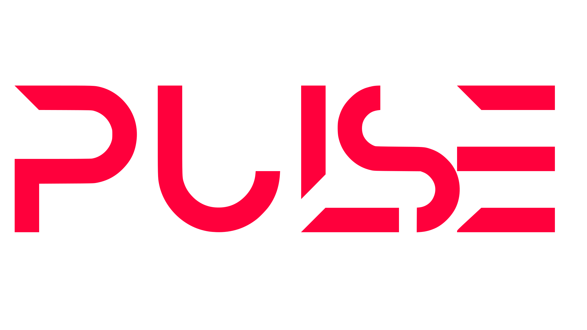

# Pulse-CLI

CLI to manage Pulse framework projects

## Table of Contents

- [Pulse-CLI](#pulse-cli)
- [Table of Contents](#table-of-contents)
- [Prerequisites](#prerequisites)
- [Getting started](#getting-started)
  
# Prerequisites

* Node v21.7.1

# Getting started

* Clone the repository and install dependencies: 
  
  ```npm install```

* While in the project root directory, install globally with

  Run ```npm install -g .```

* Generate a new project with 
  
   ```pulse new```
